# Aplicación para crear reportes

Este proyecto es una aplicación web desarrollada en PHP que nos permite crear y reportes de factura.
En este, hacemos uso de tecnologías como
- **PHP**
- **MySQL**
- **XAMPP**
- **FPDF**

Entre otras..
___
### Para crear reportes en esta aplicación, debes ir hacia el apartado de crear facturas.
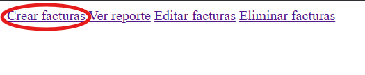

### Una vez estás aquí, puedes crear una factura llenando los campos de:
- Descripción
- Categoría
- Cantidad
- Precio
- ITBIS
- Descuento

Tras llenar los campos debes presionar el boton de enviar.
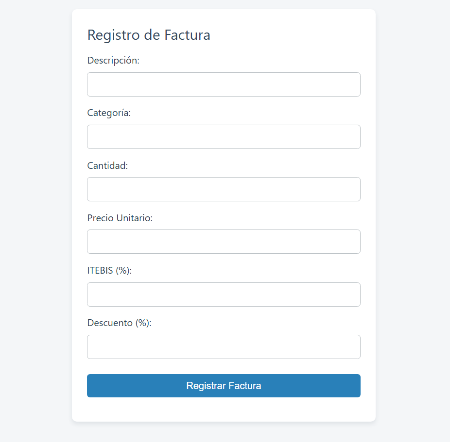

## Ahora, podemos imprimir facturas de nuestros reportes de compra.
### Antes de nada, debemos ir a la sección de leer reportes.
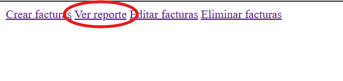

Aqui, presionamos el texto sombreado de imprimir
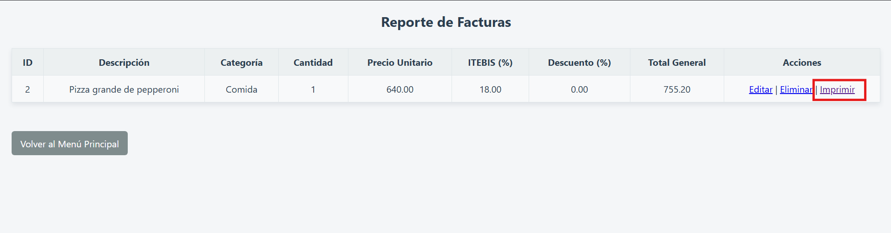

Entonces, nos llevará a otra página que hará una factura en pdf del registro que podemos imprimir.
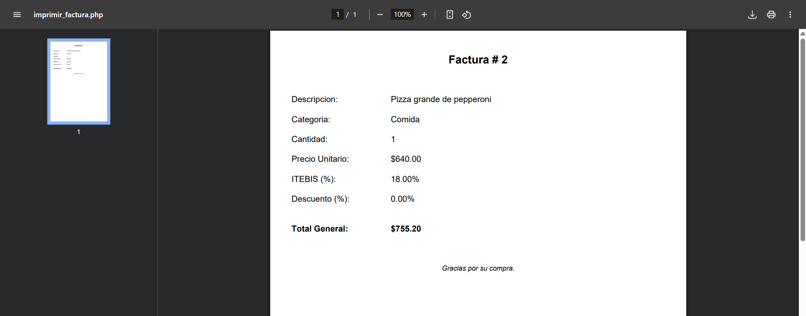

### También podemos editar nuestros registros/facturas haciendo uso del botón editar.
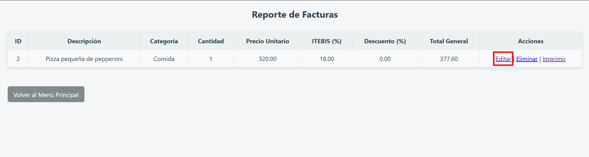

E ingresamos los nuevos datos de nuestro registro y actualizamos.
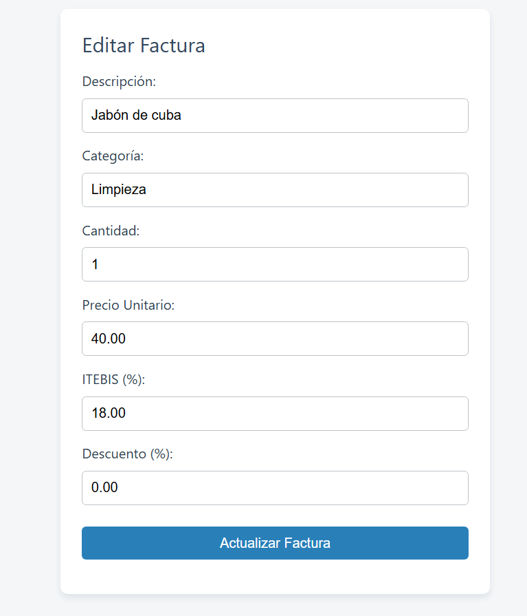
g
Así se vería nuestro registro editado.
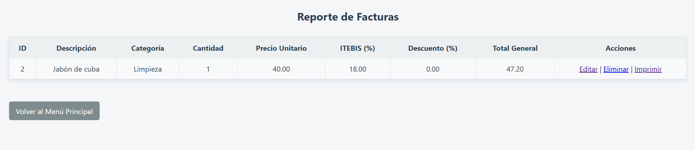

Y así nuestra factura editada.
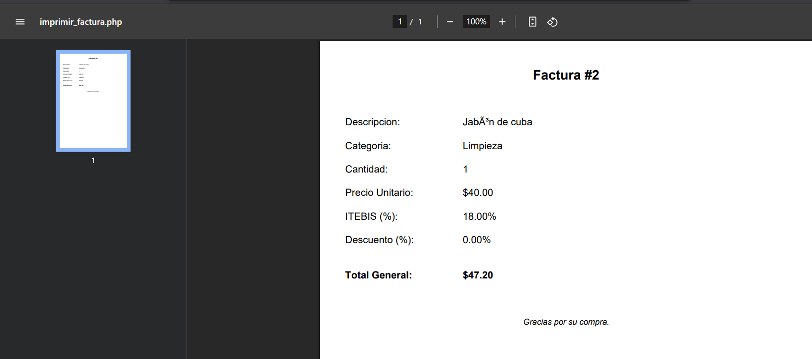

### Y así como podemos editar nuestros registros, podemos eliminarlos.
Simplemente debes presionar en el botón de eliminar.
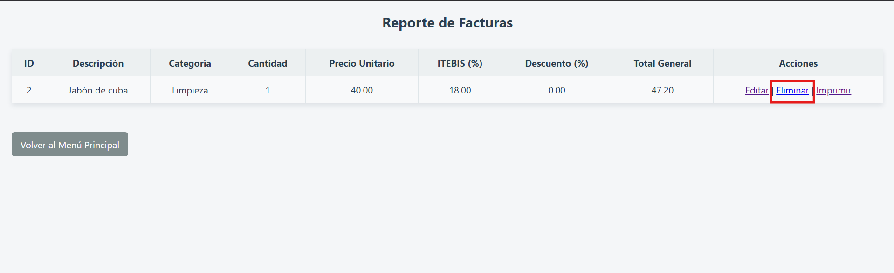

Y aceptar.
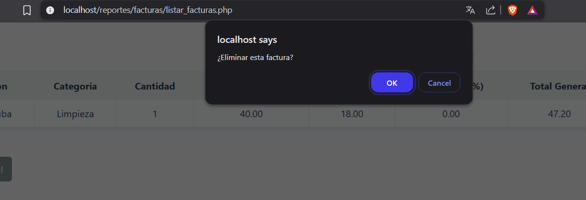
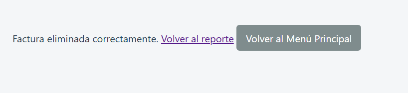

___
## Esta fue una guía corta pero completa para que puedas usar esta aplicación web para crear tus reportes y facturas.